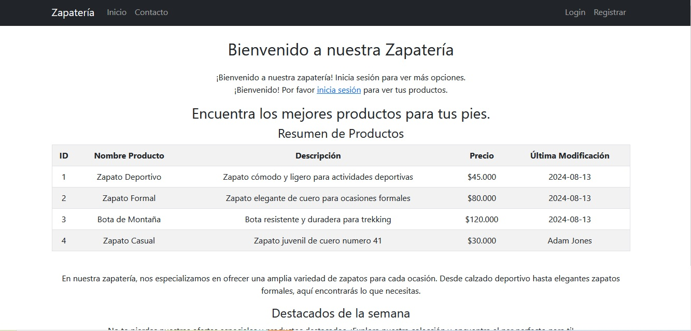
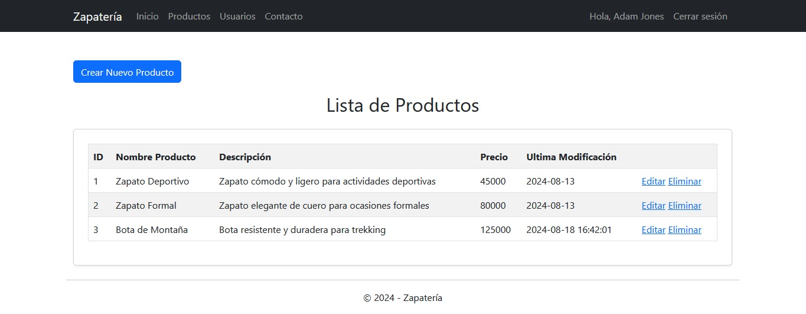
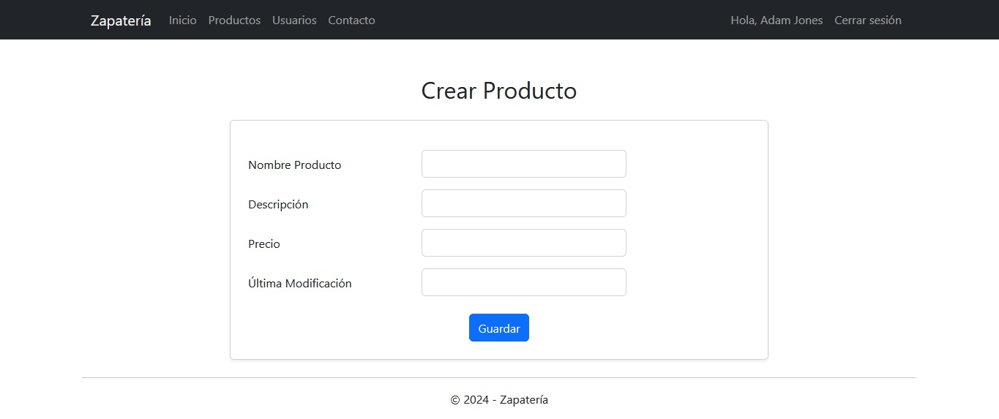
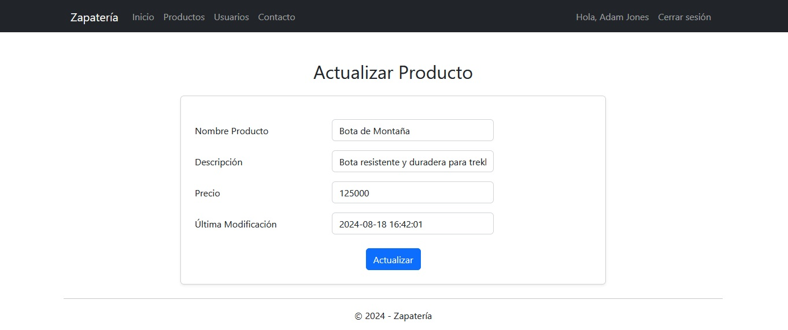
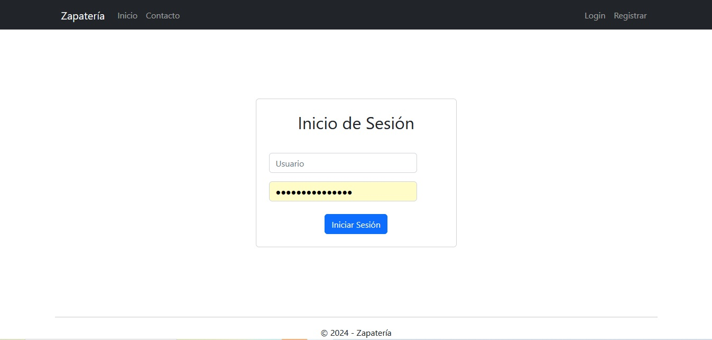
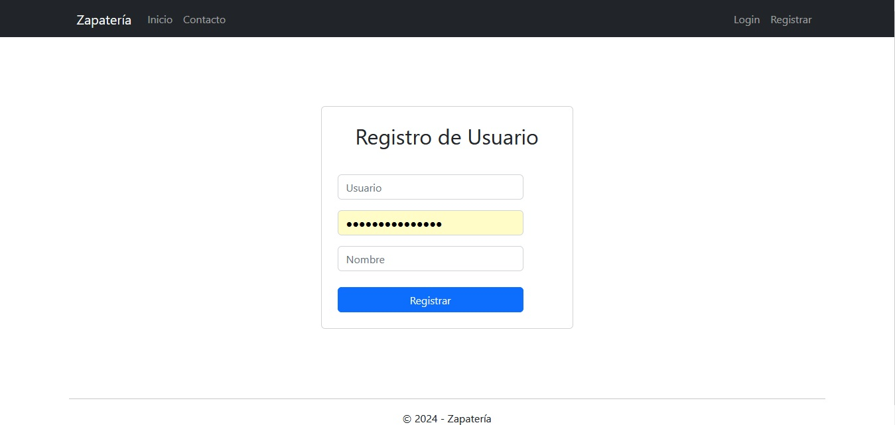

# Proyecto Zapatería

Este proyecto es una aplicación web de gestión de una zapatería desarrollada en ASP.NET Framework. Permite a los usuarios autenticarse, gestionar productos, y realizar CRUD (Crear, Leer, Actualizar y Eliminar) sobre los productos y usuarios de la zapatería.

## Características

- **Autenticación de Usuarios:** Los usuarios pueden autenticarse utilizando un servicio web. Un usuario por defecto está disponible para autenticarse, y otros usuarios se pueden obtener de la base de datos.
- **Gestión de Productos:** Los usuarios autenticados pueden ver, añadir, editar y eliminar productos. El campo `ultima_modificacion` se actualiza automáticamente con el nombre del usuario que realizó la última modificación.
- **Gestión de Usuarios:** Administra usuarios dentro del sistema, incluyendo la capacidad de editar y eliminar usuarios existentes.
- **Validaciones:** Utiliza validadores de ASP.NET para garantizar la integridad de los datos ingresados.
- **Diseño con Bootstrap:** La interfaz de usuario se ha diseñado utilizando Bootstrap para un diseño moderno y responsive.
- **Sitemap:** Navegación estructurada con un sitemap que incluye las páginas de inicio, productos, usuarios y contacto.
- **Página Maestra:** Uso de una página maestra (`Site.Master`) para un diseño consistente en todo el sitio.

## Capturas de Pantalla

### Página de Inicio

### Listado de Productos

### Crear Productos

### Editar Productos

### Login

### Registro

## Requisitos

- **ASP.NET Framework 4.8**
- **Visual Studio 2019 o superior**
- **SQL Server** para la base de datos
- **Entity Framework** para la interacción con la base de datos

## Estructura del Proyecto

- **ZapateriaDAL:** Capa de acceso a datos que interactúa con la base de datos.
- **Pages:**
  - `Productos.aspx`: Página para listar, añadir, editar y eliminar productos.
  - `Usuarios.aspx`: Página para listar, editar y eliminar usuarios.
  - `EliminarProducto.aspx`: Página para confirmar la eliminación de productos.
  - `EditarUsuario.aspx`: Página para editar los detalles de un usuario.
- **Master Pages:**
  - `Site.Master`: Página maestra que define el diseño global de la aplicación.
- **Sitemap:** Navegación del sitio, estructurada y accesible desde todas las páginas.

